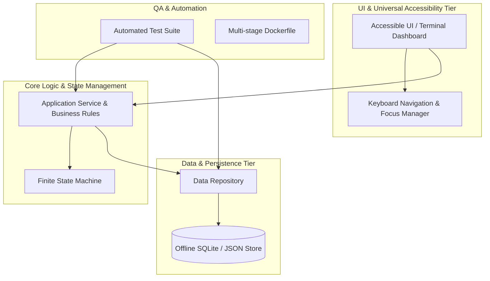

# Project Mental Topology & Mindmap Protocol (`project_mindmap.md`)

```markdown
# 🗺️ Project Mental Topology & Architecture Mindmap



---

## 🔎 Rapid Search & Symbol Index

| Tier / Layer | Component / File | Key Classes / Functions | Responsibility |
| :--- | :--- | :--- | :--- |
| **UI** | `ui/accessible_dashboard.py` | `DashboardView` | Keyboard-first rendering |
| **Core** | `core/business_service.py` | `AppService` | Domain operations |
| **Data** | `data/sqlite_store.py` | `DatabaseContext` | Atomic data storage |
| **Tests** | `tests/test_service.py` | `test_valid_operations` | Automated unit testing |
```
