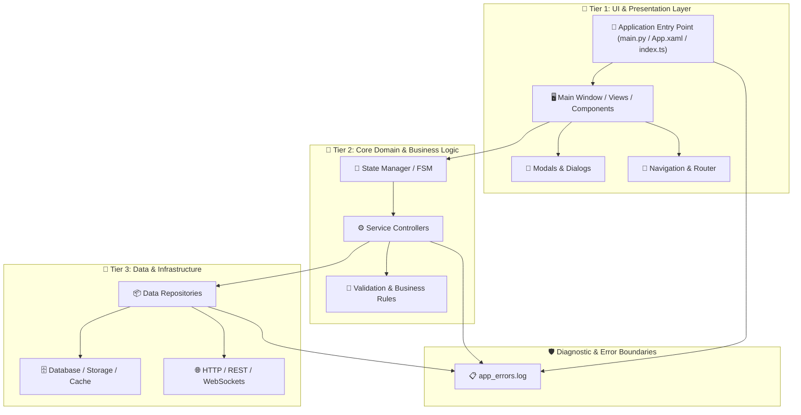

# Project Architecture & Mental Topology Map (`project_mindmap.md`)

A comprehensive, searchable mental map and visual topology representing the structural layers, data flows, entry points, dependencies, and state boundaries of the project.

---

## 1. High-Level Visual Mindmap (Mermaid & ASCII)

---

## 2. Structural Layer Topology & Component Registry

### 🚀 1. Entry & Bootstrapping
- **Primary File**: `[path/to/entry]`
- **Initialization Lifecycle**: Config setup -> Service registration -> State load -> UI render.
- **Global Handlers**: Uncaught error handlers -> `app_errors.log`.

### 🎨 2. UI & Presentation Layer
| Component / View | Responsibilities | User Events / Triggers | Connected Controller |
|---|---|---|---|
| `MainDashboard` | Primary view & status display | Button clicks, tab switches | `DashboardController` |
| `SettingsDialog` | Preference editing & storage | OnSave, OnReset | `SettingsService` |

### 🧠 3. Core Logic & State Machines (FSM)
| Module / Class | Single Responsibility | Public Methods / Contract | Dependent Services |
|---|---|---|---|
| `AudioEngine` | Record, playback, stream handling | `Start()`, `Stop()`, `Seek()` | `StorageManager` |
| `AuthService` | User session management | `Login()`, `Verify()` | `NetworkClient` |

### 💾 4. Data Storage & External Integrations
| Source / Table | Format / Engine | Sync Policy | Error Fallback |
|---|---|---|---|
| `UserSettings` | Local JSON / SQLite | Atomic write on change | Default config fallback |
| `RemoteAPI` | HTTPS REST JSON | Asynchronous retry (3x) | Cached offline queue |

---

## 3. Bug & Hotspot Tracking Map (خريطة النقاط النشطة والأعطال)
- 🟢 **Resolved Nodes**:
  - `TextView::lineSpacingExtra` -> Removed unsupported reflection call in layout table.
- 🟡 **Monitored / High-Traffic Nodes**:
  - `MediaSessionCallback` -> State synchronization across background threads.
- ⚪ **Pending Review**:
  - `[None]` -> All current branches verified clean.

---

## 4. Rapid Search Index (دليل البحث والاستكشاف السريع)
Use this index to quickly locate specific subsystem owners:
- **UI & Layouts**: `src/ui/`, `views/`, `templates/`
- **Business Logic**: `src/core/`, `services/`, `controllers/`
- **Data Persistence**: `src/data/`, `models/`, `db/`
- **Diagnostics & Backups**: `.backups/`, `debug_manifest.json`, `debug_tasks.md`
