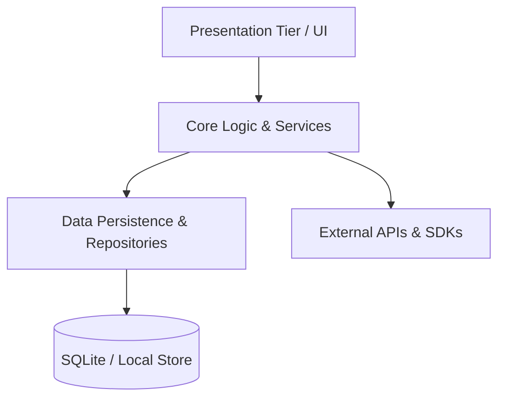

# Project Architecture & Mental Topology Mapping Template (`project_mindmap.md`)

## Symbol Directory
- **UI Components**: `MainWindow`, `ContactView`
- **Core Logic**: `ContactService`, `ValidationEngine`
- **Data Repositories**: `SqliteContactRepository`
- **Diagnostic Nodes**: `app_errors.log`